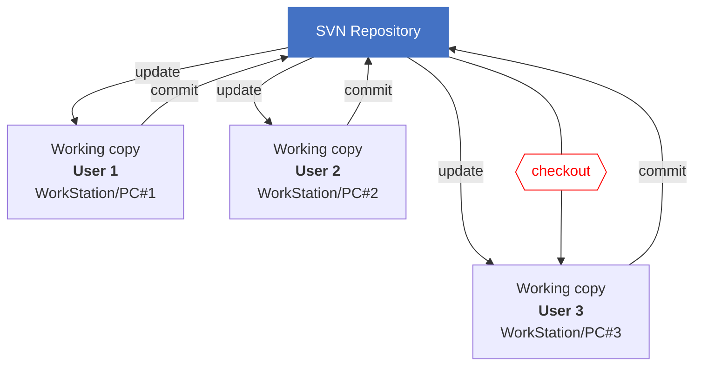
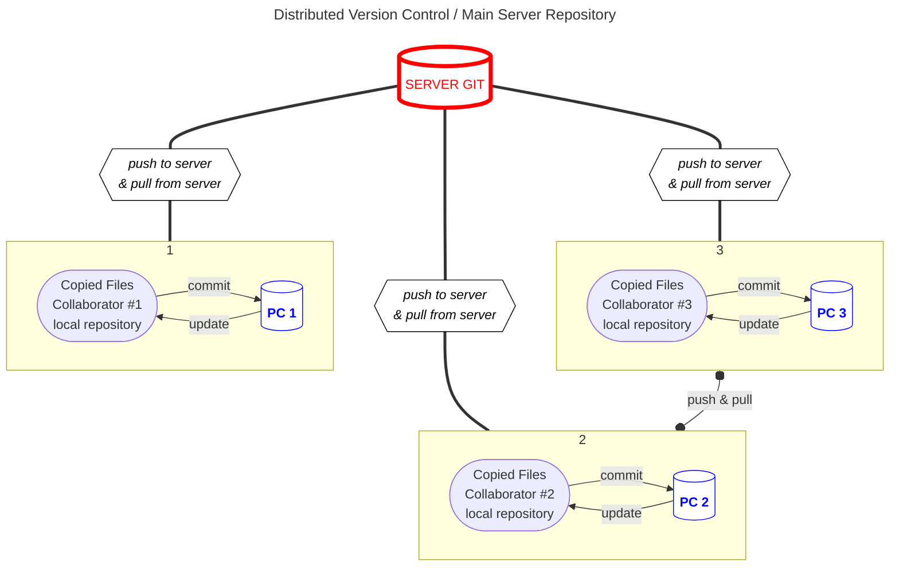

# Modèle décentralisé

Il existe deux modèles, le centralisé et le décentralisé.

- Centralisé : Centralisation du code source du projet, les utilisateurs doivent se connecter au serveur pour travailler dessus. Exemple : SVN

- Décentraliser : Le code source est hébergé sur un serveur distant, les utilisateurs sont cette fois invité à télécharger les fichiers pour pouvoir travailler de leurs cotés. Exemple : GitHub

## Avantages et inconvénients du modèle

| Avantages            | Inconvénients                |
| -------------------- | ---------------------------- |
| - Plus rapide        | - Plus complexe              |
| - Plus de back-up    | - Gestion des droits d'accès |
| - Travail hors ligne | - Besoin de synchronisation  |
| - Flexible           |

## .git

`.git` est un répertoire utiliser par git, il contient toutes les informations nécessaire à git pour suivre les données relatives au projet.
