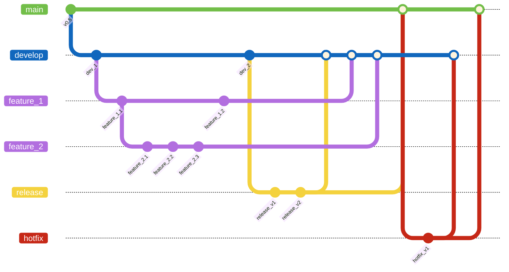
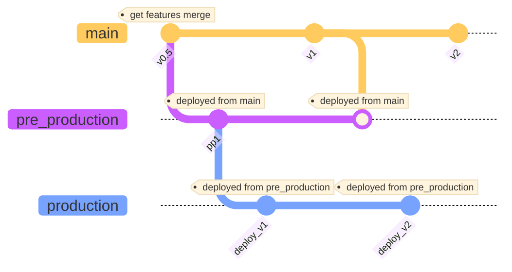

# Branching strategy

Le branching strategy est une méthode d'organisation, comment les branches sont organisé et la façon dont on les fusionnent.

L'idée principale du branching strategy est de diviser le travail entre plusieurs branches, cela permet un développement plus facile sans conflict entre le travail de chacun, une bonne branching strategy permet une meilleur productivité au sein d'une équipe.

## La stratégie _Git flow_

<!-- -->

La stratégie _git flow_ sépare le travail en 5 branches :

- **Main** pour les versions stables.
- **Develop** pour le développement continue.
- Feature, chaque fonctionnalité a implémenter a sa propre branche
- Release pour verifier une nouvelle fonctionnalité avant sa publication
- Hotfix pour les correctifs de bug

Cette méthode permet un développement plus intuitif et simple d'oganisation. On notera que sur le git remote il n'y a que les branches développement et main (les autres sont des branches temporaires)

## La stratégie _Gitlab flow_

_Gitlab flow_ est totalement différent, il contient les branches suivantes :

- **Production**

  Représente l'environnement stable où les versions approuvées sont déployées pour les utilisateurs finaux (reçoit des merges de _Pre-production_ approuvées).

- **Pre-production**

  Sert à tester les bug et à les résoudre, puis quand tout est résolu et approuvé, la branche est mergé sur _Main_ et _Production_.

- **Main**

  Reçoit les features et les fix fait dans la _Pre-production_.

- **Feature**

  Ajout de fonctionnalités, puis merge sur _Main_.

_GitLab Flow_ est plus flexible que le _git Flow_, ce qui le rend adapté à une variété de projets, tel que les projets plus petits et ceux qui nécessitent une approche plus légère de la gestion des branches.
