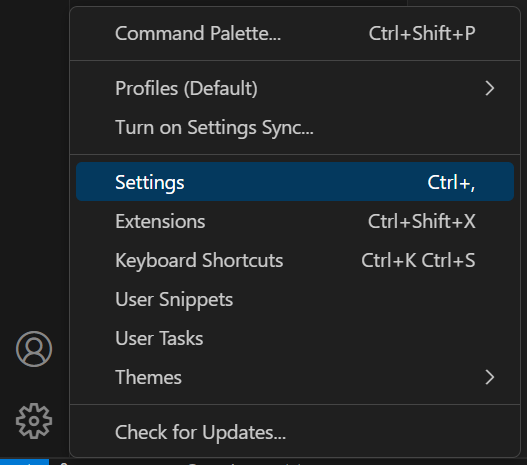
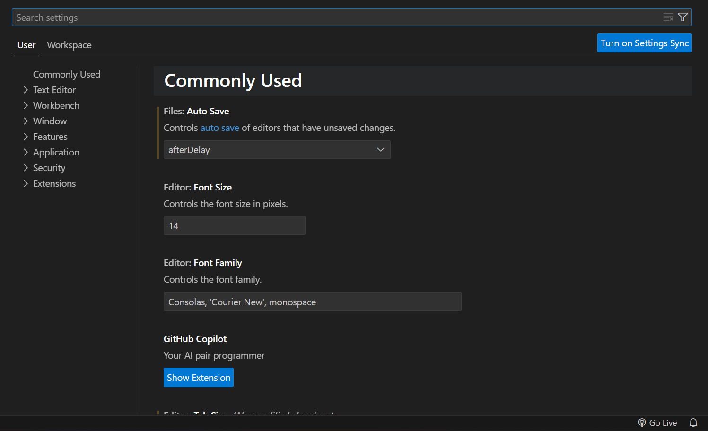

# Ajout d'images dans la documentation

Dans cette documentation, vous apprendrez comment ajouter des images facilement et simplement via VS Code.

## Copier / Coller

Pour copier/coller une image, il vous suffit de copier une image ``Ctrl + C`` ou ``Cmd + C`` et de coller l'image ``Ctrl + V`` ou ``Cmd + V`` sur le document VS Code.

Cela aura pour conséquence d'insérer une ligne de ce genre : ````

## Paramètres de l'image

### Le texte alternatif

Il est possible de gérer le texte alternatif ``[Alt text]`` de l'image.  
Pour plus d'informations à propos du [Texte alternatif](https://developer.mozilla.org/fr/docs/Learn/HTML/Multimedia_and_embedding/Images_in_HTML#texte_alternatif).

__Ex : __````


### Le lien de l'image

Il est possible d'utiliser des chemins absoluts/relatifs mais aussi hébergés sur le Web.  
Pour plus d'informations à propos des [URL](https://developer.mozilla.org/fr/docs/Learn/Common_questions/Web_mechanics/What_is_a_URL)

__Ex : __````


### Emplacement de l'image dans le dossier de travail

Lors du copier/coller, l'image apparait par défaut dans le dossier de travail. Cependant, il est possible de décider du chemin par défaut.

Dans l'exemple suivant, nous définirons le chemin du dossier dans lesquelles les images seront enregistrées.

Étape 1 : Aller dans les paramètres de VS Code ``Crtl + ,``



Étape 2 : Rechercher le terme ``Markdown``



Étape 3 : Cliquer sur le bouton ``Add Item``


Étape 4 : Dans le champs ``Item``, entrer le chemin de votre dossier. Ici on choisit n'importe quel dossier pour que cela fonctionne n'importe où.  
Dans le champs ``Value``, entrer le nom du dossier où les images seront enregistrées. Le dossier sera créé automatiquement s'il n'existe pas déjà, ici on nomme notre dossier ``assets``.

