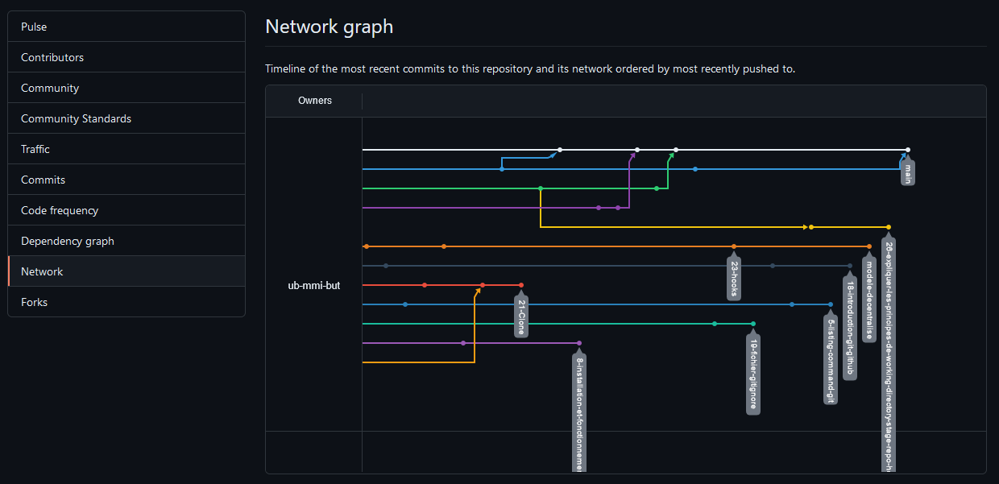
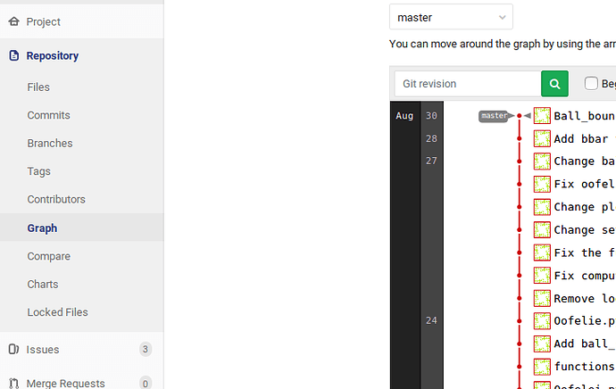

# Utilisation de Git Graph

## Qu'est ce qu'un Git Graph ?

Un Git Graph est une représentation/revisualisation des `Commits` et des évènements sur les différentes branches du projet.

**Légende**

- Chaque trait de couleur représente une branche du projet, le nom de la branche est affiché
- Chaque point représente un commit de la branche

## Comment avoir accès au Git Graph du projet ?

Pour avoir accès au Git Graph du projet, il suffit d'aller sur l'onglet `Insight` de la barre de navigation de Github.

Ensuite, choisir `Network` et le graph s'affichera.

Pour GitLab, il faut aller dans `Repository` puis choisir `Graph`.

