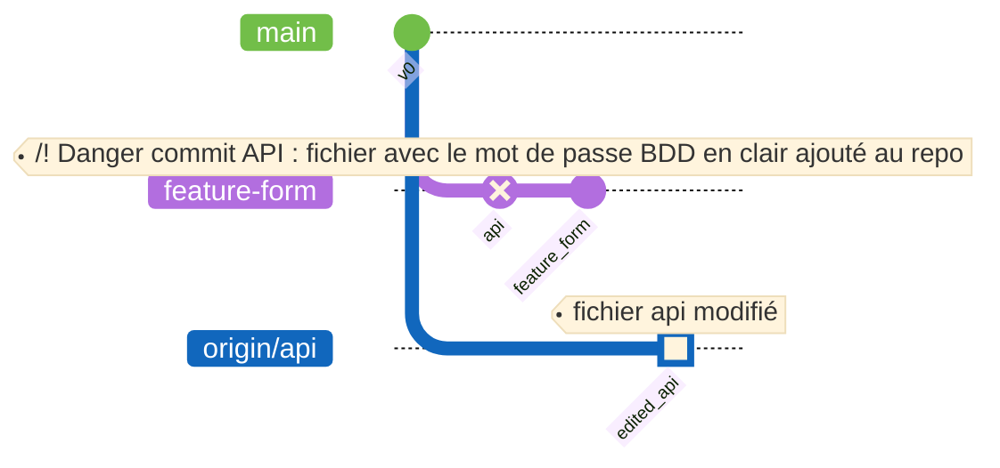

# Getting started with Git

## Plan de l'histoire

- Le projet d'Emma et Eric
- Création d'un projet GitHub
- Création d'un projet git local
- Clone du projet par Eric
  - Il essaie de push des modifications sur 'main', mais sa tentativ est rejetée car Emma a push un deuxième commit depuis son clonage.
  - Il fait crée branche.
    - checkout, checkout -b, push, lien vers la doc Git Flow
- Form, API, mot de passe, réécriture, rebase onto

## **Installation d’un projet**

Le département Informatique a pour projet de développer le nouveau site du BUT Informatique.

Afin de mener à bien ce projet et de ne pas répéter les erreurs de développement des précédentes équipes, Emma et Eric, étudiant en BUT Informatique en charge du projet, vont créer un nouvel environnement de travail.

Ils vont utiliser  **[Github](./1.%20Introduction/github.md)** afin de pouvoir travailler à plusieurs sur un même projet et ainsi conserver une trace de tout les modifications ajoutées au futur nouveau site Web.

### I) Création du repository sur Github

Emma est chargée de créer l'environnement Github. Pour cela, voici comment elle va procéder :

1. Création d’un **repository** (projet) distant sur Github nommé "Site-des-informatiques"
2. Laisser le repository en public
3. Laisser décoché le Readme (On en créera un plus tard si besoin)
4. Cliquer sur "Create repository"

!!! success
    Nous avons maintenant un repository sur Github. Github étant un [modèle décentralisé](./2.%20Notions%20de%20base/modeleDecentralise.md), nous avons besoin de créer un environnement de travail sur notre machine en local.

### II) Création du repository en local

Maintenant qu'Emma à créé le projet sur Github, elle doit maintenant créer le dossier qui acceuillera le projet sur sa machine, en local.

1. Créer un dossier sur votre pc
2. L’ouvrir via un environnement de développement intégré (IDE), ici nous utiliserons Visual Studio Code :
    [ Installer VS Code](https://code.visualstudio.com/download)
3. Ouvrir un Terminal (menu en haut de page : Terminal -> New Terminal)
4. Réaliser les commandes suivantes dans ce terminal pour mettre en lien votre dossier local avec votre repository Github :
    - `git init`
    - `git remote add origin https://Github.com/User/Site-des-informatiques.git`

!!! failure
    Emma a un problème en local, sa branche par défaut s'appelle **master** tandis que dans le repository distant elle s'appelle **main**.
    Pour régler ce problème, Emma a la super idée d’utiliser la commande suivante :

    - `git branch -M main`  (renomme la branche **master** dans laquelle Emma se trouve en **main**)
  
    Emma peut désormais communiquer proprement avec son repository sur Github !

Pour réaliser le site, Eric et Emma ont décidé d'utiliser un **framework** back-end basé sur **[Node.js](https://nodejs.org)** du nom de **[Next.Js](https://nextjs.org)**.

Ils installent le projet via Next.Js sur l'ordinateur d'Emma, ce qui amène à la construction automatique d'un site basique avec l'ajout de nombreux fichiers (merci Next.Js).

Emma part en pause café et Eric a la "bonne idée" de **supprimer** certains fichiers du projet local d'Emma, dont le fichier "**.gitignore**".

Emma ne le remarque pas et souhaite sauvegarder une première fois son projet sur Github. Elle utilise la commande suivante :

- `git add --all` (ajoute tous les fichiers dans le futurs **commit** afin de les amener sur le repo distant)
  
!!! danger
    Oh mon dieu ! Tous les modules on été ajouté dans le `commit` et ce n'est pas une bonne chose.

    Si Emma push , çela causera de très gros problèmes de place. Les modules npm (installés automatiquement lors de l'installation de Next.Js) sont très nombreux et lourd. 

Emma se rend compte que quelque chose ne vas pas, fait ses recherches et fini par trouver de la documentation sur le fonctionnement du fichier [.gitignore](./2.%20Notions%20de%20base/fichier-gitignore.md). Pour résoudre ce problème, il faut recréer le fichier .gitignore et le remplir comme ci-dessous :
```bash
# dependencies
/node_modules
/.pnp
.pnp.js

# testing
/coverage

# next.js
/.next/
/out/

# production
/build

# misc
.DS_Store
*.pem

# debug
npm-debug.log*
yarn-debug.log*
yarn-error.log*

# local env files
.env*.local

# vercel
.vercel

# typescript
*.tsbuildinfo
next-env.d.ts
```

Ce fichier permet de ne pas ajouter automatiquement des fichiers / dossiers que l'on ne voudrait pas lors de la commande `git add` (réalisez la commande `git add -h` pour afficher les différentes options de cette commande).

Elle réalise enuite la commande `git status` pour vérifier si les modules sont toujours dans la **Staging Area**. La Staging Area est un endroit où se trouvent les fichiers qui vont être commit.

!!! warning
    Les modules sont toujours prêt à être commit puisqu'ils sont toujours dans le Staging Area.

    Pour résoudre ce propblème, elle doit réaliser la commande `git restore --staged .` afin enlever les fichiers nodes-modules du Staging Area.

	!!! failure
		Vu qu'Emma n'a pas encore 'commit', le pointeur HEAD (référence au dernier commit réalisé dans la branche courante) n'a pas été créé, ce qui crée une erreur : 

        ```
        fatal: Could not resolve HEAD
        ```
    
    Emma a le bon réflexe. Elle va voir [la documentation de git](https://docs.gitlab.com/ee/topics/git/unstage.html) pour supprimer un fichier du stage, puis exécute la commande `git rm --cached ./node_modules`.

    Comme `node_modules` est un dossier, l'erreur `fatal: Not removing './node_modules' recursively without -r` est reçue. Elle ajoute donc l'argument `-r`

    !!! success
        `git rm -r --cached ./node_modules`, tout va bien ! Les node_modules ne sont plus dans le stage.

Désormais, Emma n'a plus de problème avec le `.gitignore` Emma peut donc essayer d'envoyer son travail sur Github à l'aide des commandes suivantes:

  - `git add --all`
  - `git commit -m "premier commit"`
  - `git push`

!!! failure
    Une erreur apparaît dans le terminal :

    ```bash
    fatal: The current branch main has no upstream branch.

    To push the current branch and set the remote as upstream, use    
    git push --set-upstream origin main    

    To have this happen automatically for branches without a tracking
    upstream, see 'push.autoSetupRemote' in 'git help config'.
    ```
Comme indiqué dans le message d'erreur un simple **push** pour un premier commit d'une branche ne suffit pas, il faut donc utiliser:

    `git push --set-upstream origin main`

Cela va permettre de créer la branche `main` sur le dépot distant puis faire un `git push` dessus.

### III) Arrivé d'Eric sur le projet

Eric veut dorénavant rejoindre le projet sans devoir aller sur le poste d'Emma.

Pour se faire Eric doit cloner le repo d'Emma depuis Github.

`git clone lien-ssh-du-repo` : voir documentation sur [SSH](./2.%20Notions%20de%20base/SSH.md)

!!! success
    Cela permettra à Eric de travailler depuis son poste **en local** pour ajouter ses modifications et ensuite les **[commit](./listingcommand.md/#git-commit)**

puis ajouter cette base dans le repository distant avec :

- `git add`

- `git status`

- `git commit -m "create environment for the project"`

- `git status`

- `git push origin main`

-> vérification sur Github -> création d’une branch feature/layout dans laquelle on créer une base de projet avec un layout puis :

- `git add`
- `git commit -m "create base layout for the project"`
- `git push`

## Les Branches

Eric veut maintenant créer un formulaire, il va aller sur une nouvelle branche nommée `feature-form` pour le réaliser.

Pour se déplacer sur une branche il utilise la commande `git checkout` suivie du nom de la branche:

- `git checkout feature-form`

!!! failure
    Une erreur apparaît dans le terminal :

    ```bash
    error: pathspec 'feature-form' did not match any file(s) known to git
    ```

Ce message nous dit que git n'a pas pu trouver de branche nommé `feature-form` dans le dépôt Git.

Pour résoudre ce problème Eric ajoute un argument `-b` avant le nom de la branche.

- `git checkout -b feature-form`

Cela va permettre de créer la branche puis de s'y déplacer.

Maintenant il veut vérifier qu'il ai bien une nouvelle branche `feature-form` qui a été ajouté et qu'il est bien sur cette branche, pour ce faire il utilise:

- `git branch`

```bash

  main
* feature-form

```

Il y a bien deux branches et l'asterisque est positionné sur `feature-form` montrant que c'est la branche active.

<!-- Pour créer une nouvelle branche il utilise la commande :

`git checkout -b feature`

La commande `checkout` permet de se déplacer sur une branche et  -->

### CAS DE PROBLÈMES COURANTS

"Je vois pas tes modifs" : Eric n'est soit pas sur la bonne branche, soit il n'a pas 'fetch'.

Branche qui change de nom et crée un conflit :
Merge la branche qui pose problème sur la bonne branche qui respecte la bonne convention de nommage. Supprimer la branche problématique
Puis commit et push

Problème pas possible de push car push par dessus notre travail en cours :
Rebase

Récupérer des fichiers accidentellement supprimés

Supprimer une branche trop tôt

Commit du code non terminés

Conflits de merge

Erreur Permission Denied (Publickey)

Un fichier de dépendances à été ajouté (git ignore)

Mon push a été rejeté parce que Emma a déjà push un commit avant moi, sur la même branche => `git pull --rebase`

On a pull une branche qui avait été rebase. => `git config pull.ff only       # avance rapide seulement`



