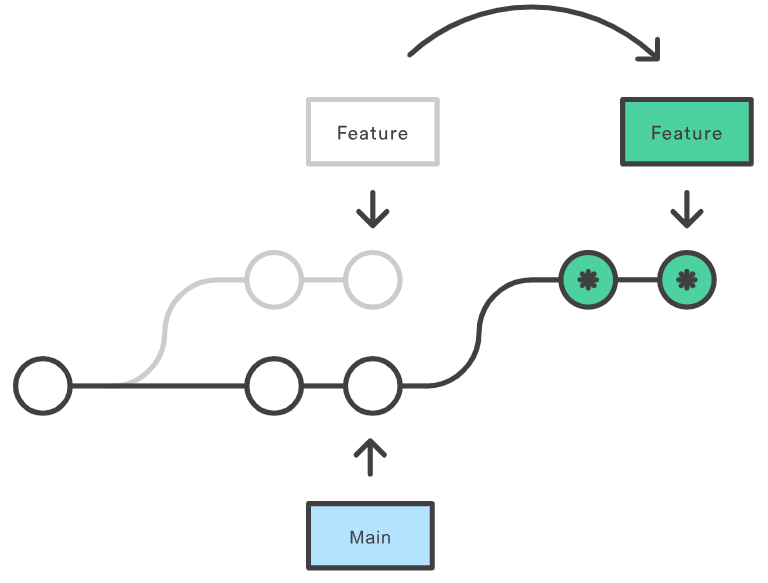

# Qu'est-ce que `git rebase` ?

## Explication générale

La commande `git rebase` est utilisée pour réorganiser l'historique des commits dans Git. Elle permet de déplacer, combiner ou modifier les commits d'une branche pour les appliquer sur une autre branche.

Le rebasage _(`git rebase`)_ fonctionne en prenant une branche (_feature_) et en la basant sur une autre branche (généralement _main_). Cela signifie que les commits de la branche de _feature_ sont replacés sur le dessus de la branche _main_, un par un.



## Cas d'utilisation

1) Imaginons que vous êtes sur une branche _feature_, vous travaillez sur votre branche de votre côté. 
2) Vous avez finis et que vous souhaitez intégrer votre fonctionnalité à la branche _main_ sauf que pendant que vous codiez sur votre branche _feature_, d'autres développeurs ont ajouté leurs modifications à la branche _main_. 
3) Alors, avant de fusionner votre branche _feature_ et _main_, il faut faire un `git rebase` pour récupérer les modifications qui ont été faites sur _main_. 

**_Détails de l'exemple_**

- Assurez-vous d'être sur la branche _feature_ en exécutant la commande suivante : `git checkout feature`
- Mettez à jour votre branche _feature_ avec les dernières modifications de _main_ en utilisant la commande git rebase : `git rebase main`

> Cette commande replacera les commits de la branche _feature_ sur le dessus de la branche _main_, un par un. Si des conflits surviennent, vous devrez les résoudre au fur et à mesure.

- Après avoir résolu tous les conflits, ajoutez les fichiers modifiés à l'index en utilisant la commande git add : `git add .`
- Continuez le processus de rebase en utilisant la commande git rebase --continue : `git rebase --continue`
- Si vous souhaitez abandonner le rebase en cours, vous pouvez utiliser la commande `git rebase --abort`
- Une fois le rebase terminé, vous pouvez fusionner votre branche _feature_ dans la branche _main_ en utilisant la commande `git merge` :
```bash
git checkout main git merge feature
```

> C'est tout! Vous avez maintenant utilisé git rebase pour réorganiser l'historique des commits et intégrer vos modifications de manière propre dans la branche principale.

## Lignes de commande

- Effectuer un rebase :
```bash
    git checkout feature
    git rebase main
```

- Pour continuer le processus de rebasage après avoir résolu les conflits
```bash 
git rebase --continue
```

- Annuler le rebase :
```bash
    git rebase --abort 
```


## `git rebase -i`

- Effectuer un rebase interactif.
```bash
    git checkout feature
    git rebase -i main
```
>_Permet d'organiser les commits d'une nouvelle branche avant de la fusionner proprement dans la branche principale_

**Exemple ICI**


## `git rebase --onto`

- Effectuer un rebase plus puissant qui transmet des réfs (points de rebase)
```bash
    git rebase --onto <newbase> <oldbase>
```
Exemple :
```bash
    git rebase --onto main featureA featureB
```
>_La branche featureB est basée sur la branche featureA. Toutefois, nous réalisons que featureB ne dépend pas des changements dans featureA et pourrait être dérivée de la branche principale. featureA est le ＜oldbase＞. main devient le ＜newbase＞, et featureB est référencé pour ce vers quoi l'élément HEAD de ＜newbase＞ pointera._


**Exemple ICI**


## Commandes supplémentaires

- Exécuter un script shell de ligne de commande sur chaque validation marquée
```bash 
git rebase --exec
```
> _Un exemple utile serait d'exécuter la suite de tests de votre base de code sur des validations spécifiques, ce qui peut aider à identifier les régressions lors d'un rebase_

- Ignorer le commit actuel et passer au suivant lors du rebasage. 
```bash 
git rebase --skip
```

- Marquer automatiquement les commits à fusionner pendant le rebasage
```bash 
git rebase --autosquash
```

## Les dangers du rebase

- En travaillant avec `git rebase`, il faut prendre en compte que les conflits de fusion peuvent devenir plus fréquent  lors d'un workflow de rebase.
Cela se produit si votre branche _feature_ est éloignée depuis trop longtemps de la branche _main_. En rebasant à ce moment là, le branche _main_ contient de nombreux nouveaux commits qui sont en conflits avec la branche _feature_.

> Rebaser fréquemment votre branche _feature_ par rapport à main et effectuer des validations fréquentes pour ne pas rencontrer ce problème.

- Un autre danger avec `git rebase` est la perte de validations résultant de la réécriture interactive de l'historique `git rebase -i`. L'exécution en mode intéractif et l'exécution de sous-commandes telles que squash `git rebase --autosquash` et drop `git rebase --d` supprimeront les validations du journal immédiat de votre branche. On peut penser que les commits ont été définitivement disparu mais en utilisant `git reflog`, ces commits peuvent être restaurés et le rebase peut être entièrement annulé. Pour plus d'informations sur `git reflog`, consulter cette documentation: 


> **Git Rebase n'est pas dangereux en soi. Les problèmes surgissent lorsque vous modifiez l'historique avec des rebases interactifs et que vous forcez ces modifications sur une branche partagée, risquant d'écraser le travail des autres. C'est une pratique à éviter.**


- Pour aller plus loin
  
[](https://www.youtube.com/watch?v=I2NQHB64ol4)


_Sources : [git-rebase](https://git-scm.com/docs/git-rebase/2.15.4) & [atlassian](https://www.atlassian.com/git/tutorials/rewriting-history/git-rebase)_